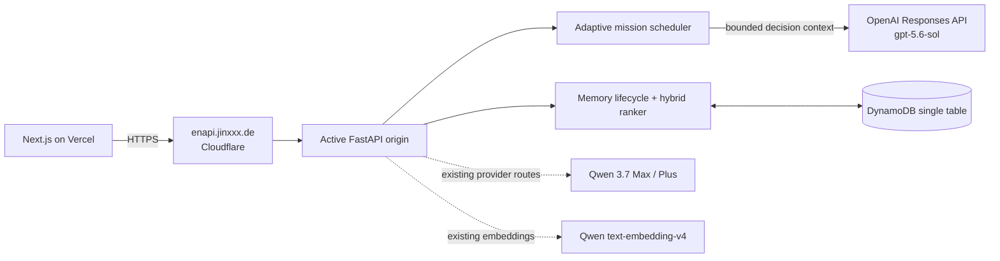

# WeakSpot English Coach

**A cross-session English coach that remembers what works for each learner.**

WeakSpot is being meaningfully extended for **OpenAI Build Week 2026 —
Education** with a new **GPT-5.6 Adaptive Mission Planner**, built in
collaboration with Codex. The existing product already accumulated goals,
preferences, recurring weaknesses, learning strategies, and practice outcomes.
The Build Week extension turns that bounded evidence into a fresh production
mission and exposes a learner-facing explanation of why the task was chosen,
which evidence shaped it, how difficulty changed, and what the coach will
observe.

Codex is the development agent, not a model embedded in the website. At
runtime, the new planner calls the official OpenAI **Responses API** with
`gpt-5.6-sol` and native Pydantic Structured Outputs. The older Qwen
MemoryAgent implementation remains documented below as the foundation this
submission extends.

Live app: [englearning.jinxxx.de](https://englearning.jinxxx.de)<br>
Primary API: [enapi.jinxxx.de/api/v1/health](https://enapi.jinxxx.de/api/v1/health)

## OpenAI Build Week extension

| New capability | Implementation |
| --- | --- |
| GPT-5.6 mission planning | Official OpenAI Responses API with explicit `gpt-5.6-sol` and `medium` reasoning |
| Structured task + rationale | Native Pydantic Structured Outputs return the mission and `plannerInsight` in one response |
| Evidence-bounded personalization | The model receives the scheduler's selected skills plus bounded goal, preference, strategy, weakness, and recency context |
| Visible runtime proof | The UI renders the model returned by the API, `Responses API`, “why now,” evidence, adaptation, and evaluation focus |
| Privacy and integrity | `store=false`, a hashed safety identifier, server-only keys, and a hard refusal to label a non-GPT-5.6 model as this feature |
| Safe rollout | `OPENAI_BUILD_WEEK_ENABLED` is opt-in, preserving existing Qwen/DeepSeek routes until the OpenAI deployment is validated |

The main implementation is in
[`openai_mission_service.py`](apps/api/app/services/openai_mission_service.py),
with the planner contract in [`coach.py`](apps/api/app/models/coach.py), prompt
and routing in [`coach_service.py`](apps/api/app/services/coach_service.py), and
the visible evidence panel in [`Coach Mode`](apps/web/app/coach/page.tsx).

### How Codex was used

Codex inspected the existing multi-provider architecture, checked current
official GPT-5.6 and Structured Outputs guidance, chose a separate Responses
API adapter instead of a blind model-string replacement, implemented the
backend and UI contract, added an offline mocked Responses API contract test,
and prepared the Devpost/video handoff. Important decisions were kept explicit:

- Codex does not run inside the product; GPT-5.6 does.
- Existing providers remain intact so the new work is a measurable extension,
  not a rewrite that hides the pre-existing foundation.
- The GPT-5.6 badge is derived from runtime response metadata and appears only
  on the OpenAI path.
- Structured output, user-data retention boundaries, and the model allowlist
  are enforced in code and covered by tests.

The timestamped build record is in
[`OPENAI_BUILD_WEEK_CODEX_LOG.md`](docs/OPENAI_BUILD_WEEK_CODEX_LOG.md). The
required Codex Session ID from `/feedback` and final commit SHA must be added
after the live validation pass.

### Enable and verify GPT-5.6

```bash
# apps/api/.env — never commit the real key
OPENAI_API_KEY=...
OPENAI_BUILD_WEEK_ENABLED=true
OPENAI_BUILD_WEEK_MODEL=gpt-5.6-sol
OPENAI_BUILD_WEEK_REASONING_EFFORT=medium
```

After deployment, `/api/v1/health` reports whether the feature is enabled and
configured without exposing the key. Generate a Coach mission and confirm the
briefing shows `gpt-5.6-sol · Responses API` plus the adaptive planner evidence
panel. If the feature is enabled without a key, or configured with a model that
does not start with `gpt-5.6`, the request fails instead of silently falling
back and producing misleading demo evidence.

## Existing MemoryAgent foundation

| Capability | Implementation |
| --- | --- |
| Autonomous experience accumulation | Qwen extracts durable memory candidates during diagnosis/chat; practice outcomes update strategy statistics automatically |
| Preferences and goals | Remembers feedback style, explanation language, learning focus, learner-defined communication/work/exam goals, and explicit manual memories |
| Efficient retrieval | Qwen `text-embedding-v4` (256d) + lexical hybrid ranking; the same embeddings help match Stealth Practice to the live topic |
| Timely forgetting | Kind-specific expiration, evidence-based weakness graduation and relapse, conflict replacement, capacity pruning, user-controlled forget, DynamoDB TTL |
| Limited-context recall | At most six memories under a 700 estimated-token ceiling with a 15% safety reserve; text chat keeps 12 recent turns |
| Improving decisions | Next skill and exercise format use mastery, error density, spacing, historical score, productive difficulty, and exploration |
| Explainability | Memory Center shows every memory; recall traces show selected IDs, component scores, and token use |

## Learning loop

```text
diagnose / chat / import / practice
  -> Qwen structured analysis + durable memory candidates
  -> consolidate, merge evidence, replace conflicts, expire stale memory
  -> store MEMORY# rows in DynamoDB
  -> hybrid retrieve into a bounded Memory Pack
  -> personalize chat, diagnosis, plan, and exercise generation
  -> grade outcome, update strategy effectiveness, and evaluate spaced mastery evidence
  -> make the next decision with more evidence
```

## Architecture



The hosting origin is independent from the new model path: whichever FastAPI
origin serves the request calls OpenAI directly for Build Week missions. The
older Oracle/Alibaba/Qwen deployment history remains in
[Architecture](docs/ARCHITECTURE.md) and the
[Alibaba/Qwen deployment runbook](docs/ALIBABA_QWEN_DEPLOYMENT.md), but Qwen
Cloud console footage is not required in the OpenAI Build Week demo.

## Product features

- Writing diagnosis with CEFR estimate, corrected text, categorized errors,
  micro-lessons, and auto-collected notes.
- Today's Mission with five production formats: generated roleplay, picture
  story, listening retell, open-ended decision, and contextual vocabulary.
- Contextual vocabulary at `/vocabulary`: use words in a real message first,
  then review provisional word-choice evidence across learning history.
- Text and realtime voice conversation, end-of-session analysis, and ChatGPT
  history import.
- Persistent learner weakness/mastery model and daily progress dashboard.
- Memory Center at `/memory`: add, inspect, edit, pin, forget, preview recall,
  inspect mastery evidence and recall traces, and see the next-action decision.
- Seven-day plan built from bounded recent evidence plus goals, preferences,
  strategies, and memories.
- Targeted practice whose skill and format adapt from actual learning outcomes.

Preview design and safety boundaries for guided, non-quiz learning are documented
in [Coach Mode / Input Lab 2.0 P0](docs/COACH_MODE_P0.md).

## Tech stack

| Layer | Technology |
| --- | --- |
| Frontend | Next.js 16, TypeScript, Tailwind CSS, shadcn/ui, Vercel |
| Build Week planner | OpenAI Responses API, `gpt-5.6-sol`, Pydantic Structured Outputs |
| Daily backend | FastAPI/Python 3.11 in Docker on Oracle Cloud, Nginx, TLS, DeepSeek |
| Existing alternate backend | Same FastAPI release on Alibaba Cloud ECS |
| Qwen | Model Studio `qwen3.7-max`, `qwen3.7-plus`, `text-embedding-v4` |
| Persistence | Amazon DynamoDB single-table design with TTL |
| Traffic routing | Stable Cloudflare API hostname in front of the active FastAPI origin |
| Voice | OpenAI Realtime API for voice chat; OpenAI Speech API for Coach listening; browser speech fallback |
| Auth | GitHub/Google OAuth, server-resolved identity, per-tier limits |

## Repository

```text
apps/api/   FastAPI, GPT-5.6/Qwen integrations, DynamoDB, MemoryAgent, tests, deploy
apps/web/   Next.js application and Memory Center
docs/       architecture, MemoryAgent design, submission, demo, deployment
```

## Learn the codebase

If you have some CS/programming background but are new to Python, FastAPI, and
production Web engineering, start with the Chinese
[beginner learning guide](development.md). It explains the required Python
syntax, HTTP/FastAPI request lifecycle, route/service/repository layering,
DynamoDB key design, the original diagnosis-plan-practice loop, server model
selection, and the complete MemoryAgent flow using the current source code.

After that, use [Architecture](docs/ARCHITECTURE.md) for the production view,
[MemoryAgent Design](docs/MEMORY_AGENT_DESIGN.md) for algorithm details, and
[Local Testing](LOCAL_TESTING.md) while making changes. A comprehensive Chinese
[source walkthrough](docs/PROJECT_CODE_WALKTHROUGH_ZH.md) follows the current
request, service, storage, and UI paths function by function.

## Quickstart

Backend:

```bash
cd apps/api
uv sync
cp .env.example .env
uv run python -m scripts.create_table
uv run uvicorn app.main:app --reload --port 8000
```

Frontend:

```bash
cd apps/web
pnpm install
NEXT_PUBLIC_API_BASE_URL=http://localhost:8000 pnpm dev
```

The OpenAI Build Week planner configuration is shown above. The pre-existing
MemoryAgent foundation may also use Alibaba Model Studio in `apps/api/.env`:

```bash
QWEN_MODEL_STUDIO_API_KEY=...
QWEN_MODEL_STUDIO_BASE_URL=https://dashscope-intl.aliyuncs.com/compatible-mode/v1
QWEN_MODEL_STUDIO_MODEL=qwen3.7-max
QWEN_MODEL_STUDIO_FAST_MODEL=qwen3.7-plus
QWEN_EMBEDDING_MODEL=text-embedding-v4
QWEN_EMBEDDING_DIMENSIONS=256
```

An embedding-only deployment can instead set `QWEN_EMBEDDING_API_KEY` and
`QWEN_EMBEDDING_BASE_URL`; this enables Model Studio vectors without changing
the server's default text provider.

## Tests and benchmark

All backend tests below run without external services by using moto and fake
structured model output:

```bash
cd apps/api
uv run python -m scripts.smoke_test
DYNAMODB_ENDPOINT_URL= uv run python -m scripts.integration_test
DYNAMODB_ENDPOINT_URL= uv run python -m scripts.memory_agent_test
DYNAMODB_ENDPOINT_URL= uv run python -m scripts.memory_benchmark
```

Frontend:

```bash
cd apps/web
pnpm exec tsc --noEmit
pnpm build
```

The deterministic MemoryAgent benchmark achieves Recall@6 `1.00`, suppresses
expired/superseded rows, stays within every conservative effective budget, and
reduces the sample context by `87.3%`. See [MemoryAgent Design](docs/MEMORY_AGENT_DESIGN.md) for the
method and live-embedding option.

## Submission material

- [OpenAI Build Week Devpost draft](docs/OPENAI_BUILD_WEEK_SUBMISSION.md)
- [OpenAI Build Week video production pack](docs/openai-build-week/README.md)
- [Codex collaboration log](docs/OPENAI_BUILD_WEEK_CODEX_LOG.md)
- [Original Qwen Devpost submission draft](docs/SUBMISSION.md)
- [Under-three-minute demo script](docs/DEMO_VIDEO_SCRIPT.md)
- [Demo video production pack](docs/demo-production/README.md)
- [MemoryAgent technical design](docs/MEMORY_AGENT_DESIGN.md)
- [Alibaba Cloud deployment evidence checklist](docs/ALIBABA_QWEN_DEPLOYMENT.md)

## License

Released under the [MIT License](LICENSE).
