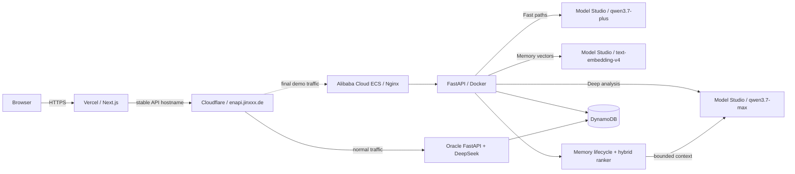

# Alibaba Cloud + Qwen 3.7 Deployment

This runbook keeps the FastAPI backend ready on Alibaba Cloud ECS and uses
Alibaba Cloud Model Studio as the text-model provider. Oracle is the normal
production origin; Alibaba is activated only for the final Qwen Cloud Hackathon
demonstration and evidence capture.

## Contest architecture



The Qwen Cloud hackathon requires proof that the backend runs on Alibaba Cloud.
For the final demo, make Alibaba ECS the Cloudflare origin behind the existing
API hostname. Do not change the Vercel API URL: retaining the hostname preserves
the OAuth callback and API-cookie boundary. Oracle remains online and returns as
the normal origin immediately after the evidence window; it must not be the only
backend shown in the submission.

## Model routing

| Workload | Model | App behavior |
| --- | --- | --- |
| Deep diagnosis, plans, session analysis | `qwen3.7-max` | Server deep model |
| Fast diagnosis, predictions, quick import paths | `qwen3.7-plus` | Server fast model |
| Memory indexing and semantic retrieval | `text-embedding-v4` (256 dimensions) | Hybrid MemoryAgent ranker |

The backend requests JSON-mode structured output. For Model Studio Qwen models,
it explicitly uses non-thinking mode because JSON mode requires it. The setting
is implemented in `apps/api/app/services/ai_client.py`.

## Alibaba ECS deployment

1. Create an ECS instance in a region that can reach the Model Studio endpoint
   associated with your API key. Ubuntu 22.04 or Alibaba Cloud Linux with Docker
   and Docker Compose is sufficient.
2. Open only ports `80` and `443` in the ECS security group. Keep port `8000`
   private; Nginx proxies to the container locally.
3. Point an API subdomain at the ECS public IP, then install Nginx and Certbot.
   The repository's `apps/api/deploy/nginx.conf.example` and `DEPLOY.md` apply
   unchanged to ECS.
4. Copy `apps/api` to the server, then create a production `.env` from
   `apps/api/deploy/.env.production.example`.
5. Set the Model Studio profile without committing the API key:

```bash
QWEN_MODEL_STUDIO_API_KEY=your_model_studio_api_key
QWEN_MODEL_STUDIO_BASE_URL=https://dashscope-intl.aliyuncs.com/compatible-mode/v1
QWEN_MODEL_STUDIO_MODEL=qwen3.7-max
QWEN_MODEL_STUDIO_FAST_MODEL=qwen3.7-plus
QWEN_EMBEDDING_MODEL=text-embedding-v4
QWEN_EMBEDDING_DIMENSIONS=256
MEMORY_ENABLED=true
MEMORY_CONTEXT_TOKEN_BUDGET=700
MEMORY_CONTEXT_TOKEN_SAFETY_RATIO=0.85

# Voice features remain OpenAI-backed and are independent of Qwen text routing.
OPENAI_API_KEY=your_openai_api_key
OPENAI_REALTIME_MODEL=gpt-realtime-mini-2025-12-15
OPENAI_REALTIME_MODELS=gpt-realtime-mini-2025-12-15,gpt-realtime-2
OPENAI_TTS_BASE_URL=https://api.openai.com/v1
OPENAI_TTS_MODEL=tts-1-hd
OPENAI_TTS_VOICE=nova
```

For an embedding-only host such as the normal Oracle deployment, omit
`QWEN_MODEL_STUDIO_API_KEY` and set `QWEN_EMBEDDING_API_KEY` plus
`QWEN_EMBEDDING_BASE_URL`. The text provider remains DeepSeek while MemoryAgent
retrieval and Stealth Practice use Model Studio embeddings.

For the China (Beijing) endpoint, use
`https://dashscope.aliyuncs.com/compatible-mode/v1`. If Model Studio gives you
a workspace-specific endpoint, use that endpoint with the API key from the same
workspace and region.

6. Set the existing DynamoDB and auth values, add the Vercel production origin
   to `CORS_ORIGINS`, then run `python -m scripts.create_table` once. It is
   idempotent and enables the DynamoDB `ttl` attribute used for memory cleanup.
7. Start and verify the service:

```bash
bash deploy/start_backend.sh
curl -fsS http://127.0.0.1:8000/api/v1/health
curl -fsS http://127.0.0.1:8000/api/v1/memory/next-action \
  -H "X-Owner-Token: $OWNER_BYPASS_TOKEN"
```

Run `python -m scripts.smoke_test` inside the deployed container as an offline
route/schema check. Before the demonstration, also verify one Fast and one Deep
Qwen request, a 256-dimensional `text-embedding-v4` response, and a short TTS
response. The `tts-1` family supports a smaller voice set than newer speech
models, so keep the documented `tts-1-hd` + `nova` pair together unless both
values are revalidated.

8. Configure Nginx and TLS for the same stable API hostname used by Oracle. Keep
   Vercel's `NEXT_PUBLIC_API_BASE_URL=https://enapi.jinxxx.de`; no frontend
   redeploy is needed for an origin-only switch.

## Normal and final-demo traffic switch

Keep Oracle and Alibaba on the same application commit and shared DynamoDB
table. Oracle retains its DeepSeek defaults for daily use; Alibaba retains its
Qwen 3.7 Max/Plus and `text-embedding-v4` defaults for the final demo.

1. Before the demo, verify `/api/v1/health` locally on both servers and confirm
   Alibaba's `/api/v1/llm/models` exposes Qwen.
2. Change only the proxied Cloudflare `enapi` origin from Oracle to Alibaba.
3. Verify the public health endpoint, CORS from the Vercel app, authentication,
   and one non-destructive Qwen request. Confirm the marked request appears in
   Alibaba's Nginx/application log.
4. Capture the submission evidence.
5. Change the Cloudflare origin back to Oracle, verify the public health/model
   endpoints again, and confirm a marked request reaches Oracle.

Do not enable browser-side automatic failover. It would make model attribution
ambiguous and may split multi-step sessions across different server defaults.

## Submission evidence checklist

- Link `apps/api/app/config.py` and `apps/api/app/services/ai_client.py` in the
  code repository to show the Model Studio Qwen profile and API behavior.
- Link `apps/api/app/services/memory_service.py`, `embedding_client.py`, and
  `decision_service.py` to show the Track 1 implementation.
- Show the Alibaba ECS instance and the healthy public API endpoint in the demo.
- Show the Model Studio console with access enabled for `qwen3.7-max` and
  `qwen3.7-plus`; do not show the API key.
- Include the Mermaid architecture diagram above in the Devpost submission.
- Show Memory Center, a bounded recall preview, and DynamoDB `MEMORY#` /
  `MEMTRACE#` items.
- Record the demo with Vercel calling the Alibaba ECS API, then show a deep and
  a fast request in the backend logs with the two Qwen model names, plus the
  `text-embedding-v4` configuration without exposing keys.
