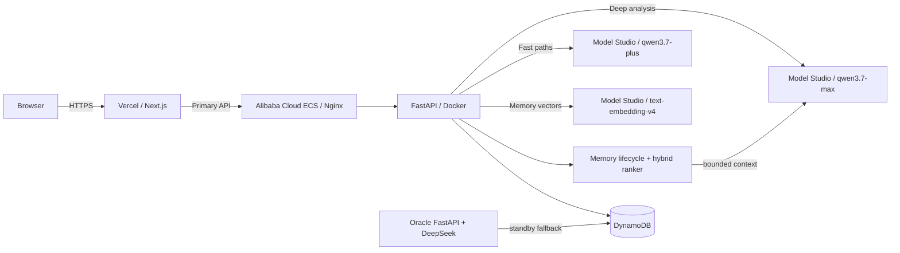

# Alibaba Cloud + Qwen 3.7 Deployment

This runbook deploys the FastAPI backend on Alibaba Cloud ECS and uses Alibaba
Cloud Model Studio as the text-model provider. It is designed for the Qwen
Cloud hackathon while retaining the Oracle deployment as a standby fallback.

## Contest architecture



The Qwen Cloud hackathon requires proof that the backend runs on Alibaba Cloud.
For the demo, make the Alibaba ECS endpoint the API origin used by the Vercel
frontend. Oracle can remain online as a rollback target, but it must not be the
only backend shown in the submission.

## Model routing

| Workload | Model | App behavior |
| --- | --- | --- |
| Deep diagnosis, plans, session analysis | `qwen3.7-max` | Server deep model |
| Fast diagnosis, predictions, quick import paths | `qwen3.7-plus` | Server fast model |
| Memory indexing and semantic retrieval | `text-embedding-v4` (256 dimensions) | Hybrid MemoryAgent ranker |

The backend requests JSON-mode structured output. For Model Studio Qwen models,
it explicitly uses non-thinking mode because JSON mode requires it. The setting
is implemented in `apps/api/app/services/ai_client.py`.

## Alibaba ECS deployment

1. Create an ECS instance in a region that can reach the Model Studio endpoint
   associated with your API key. Ubuntu 22.04 or Alibaba Cloud Linux with Docker
   and Docker Compose is sufficient.
2. Open only ports `80` and `443` in the ECS security group. Keep port `8000`
   private; Nginx proxies to the container locally.
3. Point an API subdomain at the ECS public IP, then install Nginx and Certbot.
   The repository's `apps/api/deploy/nginx.conf.example` and `DEPLOY.md` apply
   unchanged to ECS.
4. Copy `apps/api` to the server, then create a production `.env` from
   `apps/api/deploy/.env.production.example`.
5. Set the Model Studio profile without committing the API key:

```bash
QWEN_MODEL_STUDIO_API_KEY=your_model_studio_api_key
QWEN_MODEL_STUDIO_BASE_URL=https://dashscope-intl.aliyuncs.com/compatible-mode/v1
QWEN_MODEL_STUDIO_MODEL=qwen3.7-max
QWEN_MODEL_STUDIO_FAST_MODEL=qwen3.7-plus
QWEN_EMBEDDING_MODEL=text-embedding-v4
QWEN_EMBEDDING_DIMENSIONS=256
MEMORY_ENABLED=true
MEMORY_CONTEXT_TOKEN_BUDGET=700
```

For the China (Beijing) endpoint, use
`https://dashscope.aliyuncs.com/compatible-mode/v1`. If Model Studio gives you
a workspace-specific endpoint, use that endpoint with the API key from the same
workspace and region.

6. Set the existing DynamoDB and auth values, add the Vercel production origin
   to `CORS_ORIGINS`, then run `python -m scripts.create_table` once. It is
   idempotent and enables the DynamoDB `ttl` attribute used for memory cleanup.
7. Start and verify the service:

```bash
bash deploy/start_backend.sh
curl -fsS http://127.0.0.1:8000/api/v1/health
curl -fsS http://127.0.0.1:8000/api/v1/memory/next-action \
  -H "X-Owner-Token: $OWNER_BYPASS_TOKEN"
```

8. Configure the public Nginx hostname, issue its TLS certificate, then set
   Vercel's `NEXT_PUBLIC_API_BASE_URL` to the Alibaba ECS HTTPS URL and redeploy
   the frontend.

## Oracle standby strategy

Keep the current Oracle API deployed with its existing DeepSeek environment.
Both environments can use the same DynamoDB table, so learner history remains
available after a rollback. During the Qwen Cloud demo, Vercel should point to
Alibaba ECS. If the Alibaba API must be rolled back, switch the Vercel API URL
back to the Oracle hostname and redeploy; avoid automatic browser-side failover
because session cookies are scoped to the API hostname.

## Submission evidence checklist

- Link `apps/api/app/config.py` and `apps/api/app/services/ai_client.py` in the
  code repository to show the Model Studio Qwen profile and API behavior.
- Link `apps/api/app/services/memory_service.py`, `embedding_client.py`, and
  `decision_service.py` to show the Track 1 implementation.
- Show the Alibaba ECS instance and the healthy public API endpoint in the demo.
- Show the Model Studio console with access enabled for `qwen3.7-max` and
  `qwen3.7-plus`; do not show the API key.
- Include the Mermaid architecture diagram above in the Devpost submission.
- Show Memory Center, a bounded recall preview, and DynamoDB `MEMORY#` /
  `MEMTRACE#` items.
- Record the demo with Vercel calling the Alibaba ECS API, then show a deep and
  a fast request in the backend logs with the two Qwen model names, plus the
  `text-embedding-v4` configuration without exposing keys.
