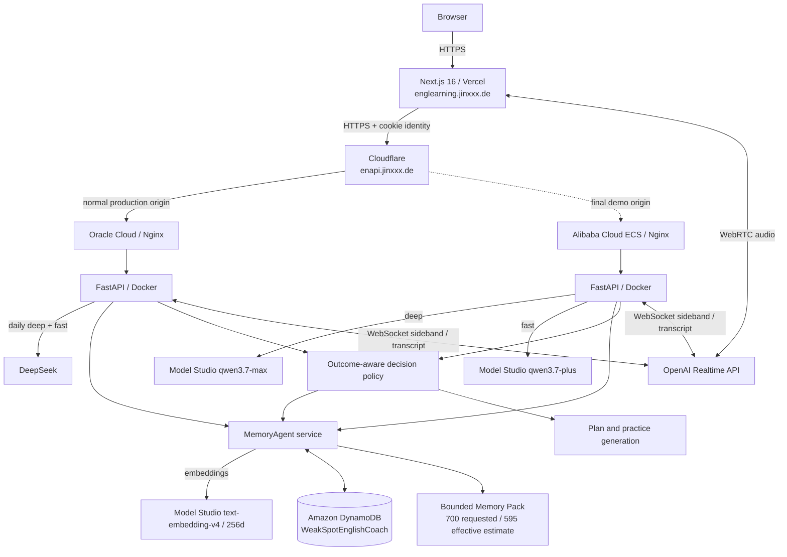
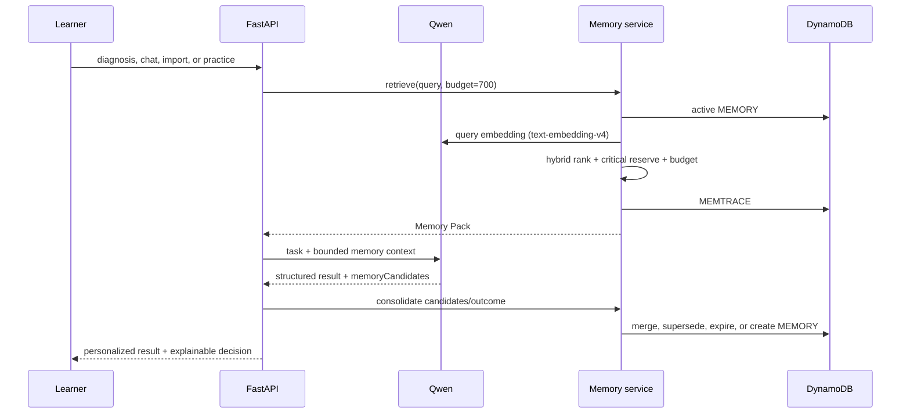

# WeakSpot English Coach — Architecture

New to Python, FastAPI, or production Web architecture? Read the
[source-guided beginner learning guide](../development.md) first, then return
here for the compact production-system view.

## Deployment architecture



Oracle Cloud is the normal production API origin. Alibaba Cloud ECS remains a
healthy, release-matched demo origin and becomes active only for the final Qwen
Cloud Hackathon demonstration/evidence window. Both deployments serve the same
`enapi.jinxxx.de` host and use the same DynamoDB table. Cloudflare changes the
origin without changing Vercel's `NEXT_PUBLIC_API_BASE_URL`, OAuth callback URL,
or API-cookie host; switching origins therefore does not discard learner state.

Before either direction of a switch, deploy the same Git commit to both hosts,
verify each local `/api/v1/health`, change the Cloudflare origin, then verify the
public health endpoint and `/api/v1/llm/models`. There is no browser-side
automatic failover because split origins would make diagnosis, session, and
model-provider behavior harder to audit.

## Memory data flow



The current user statement always wins over recalled memory. Memory failures are
isolated from the tutoring path; embeddings transparently fall back to lexical
retrieval.

## DynamoDB single-table design

Partition key is `PK=USER#{userId}`. Identity is resolved by the server, not
trusted from request bodies.

| Sort key | Entity |
| --- | --- |
| `PROFILE` | learner summary |
| `SKILL#{code}` | mastery, error/correct counts, practice dates |
| `SUBMISSION#{timestamp}#{id}` | diagnosed writing/import |
| `ERROR#{timestamp}#{id}` | normalized learning evidence |
| `SUBHASH#{hash}` | duplicate-submission guard |
| `PLAN#ACTIVE` | current seven-day plan |
| `EXERCISE#{id}` | generated exercise + decision evidence |
| `ATTEMPT#{timestamp}#{id}` | graded practice outcome |
| `NOTE#{timestamp}#{id}` | reusable expression/grammar/vocabulary note |
| `CHAT#{id}` | text or voice chat session |
| `CHATMSG#{timestamp}#{id}` | persisted chat turn/transcript |
| `MEMORY#{id}` | preference, goal, strategy, weakness, or episode |
| `MEMTRACE#{timestamp}#{id}` | recall score/token audit with 30-day TTL |

DynamoDB's `ttl` attribute performs physical cleanup. The service checks
`expiresAt` synchronously, because DynamoDB TTL deletion itself is asynchronous.

## Memory lifecycle

```text
Qwen candidate or deterministic learning signal
  -> validate confidence and canonical key
  -> equivalent active memory? merge evidence + observation count
  -> conflicting same key? create replacement + mark old superseded
  -> assign kind-specific expiry and DynamoDB TTL
  -> enforce 200-active-memory capacity (never prune pinned first)
```

Default active lifetime: preference unlimited, goal 365 days, strategy 180,
weakness 60, and episode 30. Retrieval also applies kind-specific half-life
decay before physical expiration.

## Hybrid retrieval and context control

Score components are 50% vector similarity, 15% lexical similarity, 15%
importance, 10% recency, 5% access frequency, and 5% critical kind. Pinned
memories receive a 15% boost. Up to two important goals/preferences are
reserved, then remaining slots are filled by score.

The default Memory Pack accepts a 700 estimated-token ceiling but builds against
an effective 595-token budget (85% safety ratio) using the auditable
`conservative_unicode_v2` estimate. Traces expose the requested and effective
budgets, estimate method, and compliance result. Text chat adds only the 12
newest local messages. Plan generation caps raw
skills at 20 and recent errors at 40. Prompt size therefore stays bounded as a
learner's stored history grows.

## Adaptive decision policy

The next target skill combines mastery gap (45%), recent error density (25%),
historical failure need (20%), and spacing/staleness (10%). The exercise-format
policy combines observed score, productive difficulty, exploration, and sample
reliability. Its API response includes every component score and the strategy
memory IDs that supported the choice.

## Main APIs

```text
POST /api/v1/diagnose
POST /api/v1/chat/send
POST /api/v1/chat-import/analyze
POST /api/v1/plan
POST /api/v1/practice/generate
POST /api/v1/practice/submit

GET    /api/v1/memory
POST   /api/v1/memory
PATCH  /api/v1/memory/{id}
DELETE /api/v1/memory/{id}
POST   /api/v1/memory/retrieve
GET    /api/v1/memory/traces
GET    /api/v1/memory/next-action
```

## Security and privacy

- Model, embedding, AWS, OAuth, and realtime keys remain server-side.
- Server-managed model selection exposes only allowlisted opaque IDs.
- Authenticated/guest identity overrides any body/path `userId`.
- BYOK values are request-scoped and never written to DynamoDB.
- Memory Center gives learners visibility and correction/forget controls.
- Recall traces store only a short query preview plus hash and expire after 30
  days.
