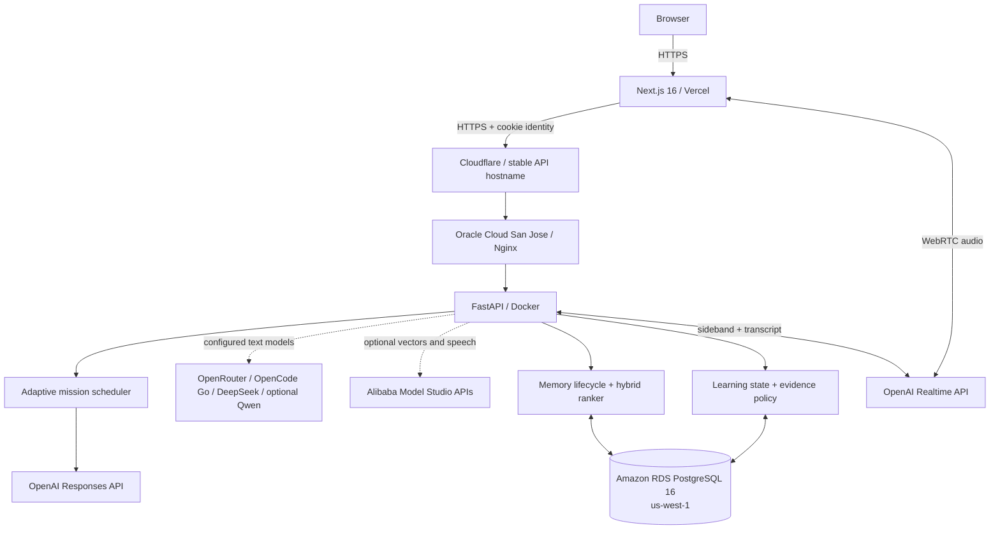
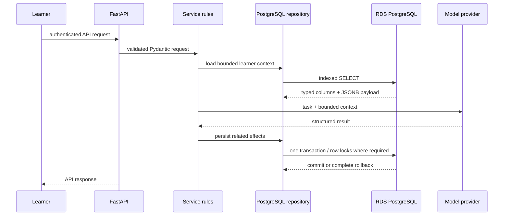

# WeakSpot English Coach — Architecture

New to the database layer? Read the
[PostgreSQL beginner guide](POSTGRESQL_BEGINNER_GUIDE.md) first.

## Production architecture


```mermaid
flowchart TB
    User[Browser] -->|HTTPS| Web[Next.js 16 / Vercel]
    Web -->|HTTPS + cookie identity| Edge[Cloudflare / stable API hostname]
    Edge --> OracleNginx[Oracle Cloud San Jose / Nginx]
    OracleNginx --> API[FastAPI / Docker]

    API --> Scheduler[Adaptive mission scheduler]
    Scheduler --> OpenAI[OpenAI Responses API]
    API -. configured text models .-> Providers[OpenRouter / OpenCode Go / DeepSeek / optional Qwen]
    API -. optional vectors and speech .-> ModelStudio[Alibaba Model Studio APIs]

    API --> Memory[Memory lifecycle + hybrid ranker]
    API --> Learning[Learning state + evidence policy]
    Memory <--> DB[(Amazon RDS PostgreSQL 16\nus-west-1)]
    Learning <--> DB

    Voice[OpenAI Realtime API] <-->|WebRTC audio| Web
    API <-->|sideband + transcript| Voice
```

Oracle is the only backend origin. Alibaba ECS is no longer deployed or used as
a standby. Alibaba Model Studio is an external API provider and does not host
the application.

RDS uses a public endpoint because the backend is outside AWS. Its security
group permits port 5432 only from the Oracle server's static public `/32`.
Connections use TLS with `sslmode=verify-full` and the AWS RDS CA bundle. See
the [RDS production runbook](AWS_RDS_POSTGRESQL_DEPLOYMENT.md).

## Request and transaction flow


```mermaid
sequenceDiagram
    participant U as Learner
    participant A as FastAPI
    participant S as Service rules
    participant R as PostgreSQL repository
    participant P as RDS PostgreSQL
    participant M as Model provider

    U->>A: authenticated API request
    A->>S: validated Pydantic request
    S->>R: load bounded learner context
    R->>P: indexed SELECT
    P-->>R: typed columns + JSONB payload
    S->>M: task + bounded context
    M-->>S: structured result
    S->>R: persist related effects
    R->>P: one transaction / row locks where required
    P-->>R: commit or complete rollback
    A-->>U: API response
```

Provider failures do not expose credentials. Memory retrieval can fall back to
lexical scoring when embeddings are unavailable. Repository transactions never
remain open while a model provider is running.

## PostgreSQL data design

The schema is relational where the application needs stable identity,
constraints, indexes, filtering, and ordering. Flexible model-produced detail
is stored in a `payload JSONB` column.

| Area | Main tables | Important relational behavior |
| --- | --- | --- |
| Identity | `users`, `access_roles`, `rate_limit_counters` | stable provider identities and daily counters |
| Learning | `profiles`, `skills`, `learning_states`, `activity_runs`, `evidence_events` | versioned state and evidence history |
| Diagnosis | `submissions`, `errors`, `notes`, `diagnosis_requests` | duplicate claims and indexed learner history |
| Planning/practice | `plans`, `exercises`, `practice_requests`, `practice_attempts` | idempotent attempts and atomic progress |
| Memory | `memories`, `memory_leases`, `memory_traces` | one-writer lease, lifecycle timestamps, recall audit |
| Input/ebooks | `input_sources`, `input_items`, `ebooks`, page/pack/target tables | foreign-key cascade cleanup |
| Chat | `chat_sessions`, `chat_messages`, `chat_transcript_batches` | atomic turns, transcript idempotency, keyset history |

All learner-owned tables use `user_id` in their primary or foreign key. Common
history paths have composite indexes such as `(user_id, created_at DESC, id
DESC)`. API cursors contain the final timestamp/ID pair and are bound to the
learner and entity type.

## Concurrency and idempotency

- `SELECT ... FOR UPDATE` serializes updates to a learning state, active plan,
  chat session, or memory lease.
- PostgreSQL `INSERT ... ON CONFLICT` makes stable request IDs safe to retry.
- Related practice, diagnosis, chat-analysis, and transcript effects commit in
  one transaction; any statement failure rolls everything back.
- Model calls happen before persistence transactions. Immutable result drafts
  permit retries without paying for or applying the same model result twice.
- Stale claim IDs are checked again inside the write transaction, preventing an
  old worker from committing after another worker takes over.

## Memory lifecycle

```text
model candidate or deterministic learning signal
  -> validate confidence and canonical key
  -> equivalent active memory? merge evidence + observation count
  -> conflicting same key? create replacement + mark old superseded
  -> assign kind-specific logical expiry
  -> immediately filter expired/inactive memory from retrieval
  -> scheduled PostgreSQL cleanup physically removes eligible rows later
```

Default active lifetime: preference unlimited, goal 365 days, strategy 180,
weakness 60, and episode 30. Retrieval applies kind-specific decay before
physical cleanup. The cleanup job is an operational task, never a correctness
dependency.

## Hybrid retrieval and context control

Score components are 50% vector similarity, 15% lexical similarity, 15%
importance, 10% recency, 5% access frequency, and 5% critical kind. Pinned
memories receive a 15% boost. Up to two important goals/preferences are
reserved, then remaining slots are filled by score.

The default Memory Pack accepts a 700 estimated-token ceiling but builds against
an effective 595-token budget. Text chat adds only the newest 12 messages. Plan
generation caps raw skills and errors. Stored history can grow without making a
model prompt grow without bound.

## Health and deployment order

- `/api/v1/health` proves the FastAPI process can respond.
- `/api/v1/health/ready` runs `SELECT 1` and proves PostgreSQL connectivity.
- Deployments apply `alembic upgrade head` before starting the new container.
- The frontend/Cloudflare origin is changed only after readiness and a focused
  learner-flow probe pass.

## Security and privacy

- Model, database, OAuth, and realtime secrets remain server-side.
- The RDS master credential is managed by AWS Secrets Manager; the API uses a
  separate non-superuser login.
- RDS storage and backups are encrypted, deletion protection is enabled, and
  CloudFormation replacements retain snapshots.
- Authenticated/guest identity overrides any body/path `userId`.
- BYOK values are request-scoped and never written to PostgreSQL.
- Memory Center gives learners visibility and correction/forget controls.
- Recall traces keep bounded audit data and expire through logical filtering
  plus scheduled cleanup.

The former DynamoDB single-table and Alibaba backend architecture is preserved
only in dated change logs and hackathon material; it is not the current runtime.
