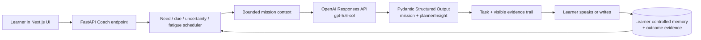

# OpenAI Build Week 2026 — Devpost Submission Draft

## Quick information

- **Project:** WeakSpot — GPT-5.6 Adaptive English Coach
- **Tagline:** An English coach that remembers your weak spots, then turns them into the right real-world mission.
- **Category:** Education
- **Live app:** https://englearning.jinxxx.de
- **Health / capability proof:** https://enapi.jinxxx.de/api/v1/health
- **Repository:** https://github.com/jinyu-cai/weakspot-english-coach
- **License:** MIT
- **Demo video:** `[ADD PUBLIC YOUTUBE URL — maximum 3:00]`
- **Codex Session ID:** `[ADD THE SESSION ID RETURNED BY /feedback]`
- **Build Week commit:** `[ADD FINAL COMMIT SHA]`

Official submission deadline: **July 21, 2026 at 5:00 PM PDT**. Recheck the
[official dates](https://openai.devpost.com/details/dates),
[rules](https://openai.devpost.com/rules), and
[FAQ](https://openai.devpost.com/details/faqs) immediately before submitting.

## One-sentence pitch

WeakSpot uses GPT-5.6 to transform a learner's bounded cross-session evidence
into a realistic speaking or writing mission, then shows exactly why that task
was selected and what successful transfer will look like.

## What it does

Most AI tutors correct the latest answer but lose the learning strategy between
sessions. WeakSpot maintains learner-controlled memory for goals, preferences,
recurring weaknesses, useful strategies, and practice outcomes. A deterministic
scheduler ranks what is due, uncertain, weak, relevant, and not over-practiced.

The new GPT-5.6 Adaptive Mission Planner receives only that bounded decision
context. It creates one realistic production task in one of five formats:

1. live roleplay;
2. picture-based description and inference;
3. listening and retelling;
4. open-ended situational decision;
5. vocabulary in a real message.

Alongside the task, GPT-5.6 returns a structured evidence panel: “why now,” the
observations it used, how the requested time/modality/energy changed the task,
and the observable language signals the coach will review. The learner then
responds, receives feedback, and adds new evidence to the same learning loop.

## Meaningful work added during Build Week

WeakSpot existed before the event. The submission asks judges to evaluate the
following extension added on **July 20, 2026**, not the earlier product by
itself:

- a dedicated official OpenAI Responses API adapter for mission planning;
- explicit `gpt-5.6-sol` routing with intentional `medium` reasoning;
- native Pydantic Structured Outputs for a mission plus planner rationale;
- a new learner-visible rationale/evidence/adaptation/evaluation panel;
- runtime metadata that displays the actual model returned by the API;
- `store=false`, privacy-preserving hashed `safety_identifier`, server-only
  credentials, and a GPT-5.6 model guard;
- public, secret-free health capability metadata;
- mocked Responses API contract coverage, frontend typing, and submission/video
  documentation built with Codex.

Timestamped Codex history, the Build Week commit, and the final `/feedback`
Session ID provide the boundary between pre-existing work and the extension.

## How GPT-5.6 is used

The planner uses the official OpenAI Responses API. It is not a label placed on
an existing provider route.

```text
bounded learner evidence + scheduler decision + practice preferences
  -> GPT-5.6 Sol / Responses API / Pydantic Structured Outputs
  -> realistic mission + whyNow + evidenceUsed + adaptation + evaluationFocus
  -> learner response and feedback
  -> new outcome evidence for the next session
```

The explicit model is `gpt-5.6-sol`. The API call uses `reasoning.effort =
medium`, `store = false`, and a hashed stable safety identifier. If the feature
is enabled without an OpenAI key, or with a non-GPT-5.6 model ID, it fails
closed. The UI displays the model returned by OpenAI and the Responses API
surface only when that runtime path generated the task.

## How Codex was used

Codex was the engineering collaborator for the Build Week extension. It:

- audited the existing FastAPI/Next.js multi-provider architecture;
- checked current official GPT-5.6, Responses API, reasoning, safety identifier,
  and Structured Outputs guidance;
- rejected a blind model-string replacement and designed an isolated,
  opt-in OpenAI runtime path;
- implemented the backend schema, API adapter, routing, privacy controls,
  frontend evidence panel, health proof, tests, README, Devpost draft, and video
  script;
- ran offline backend contract checks, Python compilation, and frontend
  TypeScript validation;
- kept live deployment, key authorization, YouTube upload, `/feedback`, and
  Devpost submission as explicit owner-controlled external steps.

Codex itself is not embedded as the product backend. The website calls GPT-5.6
at runtime; Codex's role is demonstrated through the timestamped development
session, code changes, decisions, and validation record.

## Technical architecture



## Design and safety decisions

- The planner gets a compact evidence summary, not the learner's full history.
- A deterministic scheduler chooses the target; GPT-5.6 turns that decision
  into a natural task and explains the adaptation.
- The explanation may use only supplied evidence and must state when history is
  missing instead of inventing a learner fact.
- The five practice formats require language production rather than
  multiple-choice recognition.
- Picture practice uses allowlisted first-party illustrations and does not
  pretend the model performed arbitrary visual verification.
- Listening practice uses original or owner-authorized scripts.
- Learners can inspect, edit, pin, or forget stored memory.

## Validation completed locally

```bash
cd apps/api
UV_CACHE_DIR=.uv-cache uv run python -m scripts.coach_contract_test
UV_CACHE_DIR=.uv-cache uv run python -m scripts.smoke_test
UV_CACHE_DIR=.uv-cache uv run python -m compileall -q app

cd ../web
pnpm exec tsc --noEmit
pnpm build
```

The contract test replaces the network client with a controlled Responses API
double and verifies the exact model, reasoning setting, Pydantic parser, no-store
flag, hashed safety identifier, returned runtime metadata, and planner insight.
It does not pretend to be a live OpenAI request. Separate live validation is now
complete: public health reports the enabled/configured GPT-5.6 capability, and
mission `mission_8af078f6caf7` returned `gpt-5.6-sol` from the Responses API
with all four evidence fields. The matching backend log records an OpenAI
response ID and `upstream_ok` without logging the key or learner text.

## Judging criteria mapping

### Technological implementation

Codex helped extend a mature multi-provider codebase without breaking its
existing routes. GPT-5.6 uses the Responses API and native Structured Outputs,
with explicit reasoning, privacy controls, runtime proof, validation, and a
fail-closed model guard.

### Design

Learners choose only time, response mode, and energy. The system handles the
complex selection while keeping its reasoning visible. The exercise formats
feel like real communication instead of tests, and the rationale panel makes
personalization understandable.

### Potential impact

The core learning problem is transfer: using a skill later, independently, in a
new situation. WeakSpot connects cross-session evidence to varied practice and
records whether success transfers across context and modality.

### Quality of idea

The key idea is not merely “an AI tutor with memory.” It is an evidence-bounded
loop where memory changes the next task, the task generates a fair opportunity,
and the resulting attempt changes future decisions.

## Final owner-controlled checklist

- [x] Keep the OpenAI key only in the backend deployment environment.
- [x] Set `OPENAI_BUILD_WEEK_ENABLED=true` and deploy the backend working tree.
- [x] Confirm health reports `enabled: true`, `configured: true`, model
  `gpt-5.6-sol`, and API `responses`.
- [ ] Generate a second real mission and capture application logs showing
  `openai_mission ... upstream_ok` without exposing keys or learner content.
- [ ] Check the visible GPT-5.6 evidence panel on desktop and mobile.
- [ ] Add the final commit SHA and timestamped Codex evidence.
- [ ] Run `/feedback` in the main Codex build session and paste its Session ID.
- [ ] Record a public YouTube video no longer than three minutes with audio that
  explains the product, Codex collaboration, and GPT-5.6 runtime use.
- [ ] Verify the live app is accessible without judge-specific local setup.
- [ ] Submit before the official deadline.
