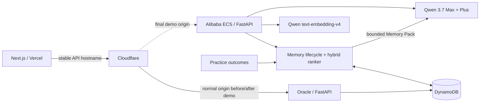

# Devpost Submission Draft — Qwen Cloud Hackathon

## Quick information

- **Project:** WeakSpot English Coach
- **Tagline:** An English coach that remembers what works for you.
- **Track:** Track 1 — MemoryAgent
- **Live app:** https://englearning.jinxxx.de
- **Primary API:** https://enapi.jinxxx.de
- **Primary compute:** Alibaba Cloud ECS
- **Qwen services:** `qwen3.7-max`, `qwen3.7-plus`, `text-embedding-v4`
- **Persistence:** Amazon DynamoDB single-table design
- **License:** MIT
- **Repository:** `[ADD PUBLIC GITHUB URL]`
- **Demo video:** `[ADD PUBLIC VIDEO URL — under 3 minutes]`

The Devpost page currently lists the deadline as **July 20, 2026 at 2:00 PM
PDT**. Recheck the [official challenge page](https://qwencloud-hackathon.devpost.com/)
before the final submission.

## What it does

Most AI tutors forget the learner when a session ends. WeakSpot remembers five
types of durable learning evidence: preferences, goals, effective strategies,
recurring weaknesses, and consequential recent experiences.

Learners can submit writing, practice through text or voice chat, import prior
ChatGPT conversations, generate a seven-day plan, and complete targeted
exercises. Qwen analyzes each interaction and proposes conservative durable
memories inside its structured response. Practice results independently update
per-skill/per-format effectiveness statistics. Before the next task, WeakSpot
retrieves only the most relevant memories into a fixed-size Memory Pack, so the
coach becomes more accurate without sending the entire history back to the
model.

The learner can inspect everything in Memory Center: what is active, the
evidence, confidence and importance, what was replaced or expired, why a memory
was recalled, how many tokens it consumed, and which memories drove the next
practice decision. They can edit, pin, or forget any memory.

## How it meets Track 1

### Persistent memory that autonomously accumulates experience

- Diagnosis, text chat, session analysis, and chat import return Qwen
  `memoryCandidates` without a second completion call.
- Diagnosed errors create recurring-weakness memories with evidence.
- Every graded attempt updates a strategy memory containing attempts, average
  score, success rate, and last outcome, plus a short-lived episode.
- All memory is stored across sessions in DynamoDB `MEMORY#` rows.

### Preferences and increasingly accurate decisions

- Stable keys represent preferences such as concise feedback, business English,
  and explanation language, plus IELTS/career goals.
- The next skill is selected from mastery gap, recent error density, historical
  failure need, and time since practice.
- The exercise format balances actual historical scores, productive difficulty,
  under-sampled exploration, and sample reliability.
- Every decision includes a reason, component scores, and supporting memory IDs.

### Efficient storage and retrieval

- Alibaba Model Studio `text-embedding-v4` produces 256-dimensional vectors.
- Retrieval combines vector similarity, lexical match, importance, recency,
  access frequency, and critical preference/goal signals.
- The deterministic fallback stays functional when embedding service is
  unavailable.
- Memory is capped at 200 active rows per learner; low-value old episodes are
  pruned first.

### Timely forgetting

- Preferences persist; goals, strategies, weaknesses, and episodes have
  different default lifetimes.
- Kind-specific half-life decay lowers stale recall before expiration.
- Conflicting facts reuse a canonical key: the new fact becomes active and the
  old one is marked `superseded`.
- The service filters `expiresAt` immediately; DynamoDB TTL removes archived
  rows later.
- Users can explicitly forget or pin memory.

### Critical recall within a limited context window

- The default Memory Pack is at most six memories and 700 estimated tokens.
- Up to two important preferences/goals are reserved before score-based fill.
- Text chat uses only the 12 latest local messages.
- Plan generation caps raw skills/errors instead of transmitting all history.
- `MEMTRACE#` rows make selection and token use auditable.

## Technical implementation



During the final demonstration and evidence capture, the primary
FastAPI/Docker origin runs on Alibaba Cloud ECS behind Nginx and TLS. Oracle is
the normal origin before and after that window. Both serve the same stable API
hostname and share DynamoDB state, so Vercel's API URL does not change.

Important code links after the repository is public:

- `apps/api/app/services/memory_service.py` — consolidation, lifecycle,
  retrieval, budget, and practice strategy updates.
- `apps/api/app/services/embedding_client.py` — Qwen embedding integration and
  fallback.
- `apps/api/app/services/decision_service.py` — explainable next-action policy.
- `apps/api/app/api/routes/memory.py` — learner memory controls and traces.
- `apps/web/app/memory/page.tsx` — Memory Center.
- `apps/api/scripts/memory_benchmark.py` — reproducible evaluation.

## Evidence and measured result

Secret-free deterministic benchmark (`moto` + lexical fallback):

| Metric | Result |
| --- | ---: |
| Recall@6 | 1.00 (5/5 fixtures) |
| Expired/superseded suppression | 100% |
| Token-budget compliance | 100% |
| Raw fixture history | 1,266 estimated tokens |
| Average Memory Pack | 220 estimated tokens |
| Context reduction | 82.6% |

Run it with:

```bash
cd apps/api
DYNAMODB_ENDPOINT_URL= uv run python -m scripts.memory_agent_test
DYNAMODB_ENDPOINT_URL= uv run python -m scripts.memory_benchmark
```

Set `MEMORY_BENCHMARK_LIVE=1` to measure the live Qwen embedding path.

## Significant update for this hackathon

The original project had an error library and selected the lowest mastery skill,
but it did not have a general memory model. This submission adds, after the
hackathon start date:

- five-class durable memory and canonical conflict replacement;
- Qwen autonomous preference/goal/strategy extraction;
- Model Studio embeddings and hybrid retrieval;
- time decay, expiration, DynamoDB TTL, and capacity pruning;
- bounded cross-session Memory Packs;
- practice-effectiveness accumulation and adaptive decisions;
- a complete Memory Center, recall audit trail, tests, and benchmark;
- Alibaba Cloud final-demo deployment and Qwen provider routing.

## Under-three-minute demo outline

1. **0:00–0:20 — Problem:** show that a stateless tutor forgets; introduce a
   cross-session learner memory.
2. **0:20–0:50 — Accumulation:** state “I am preparing for IELTS and prefer
   concise feedback,” then diagnose writing. Open Memory Center and show the
   goal/preference/weakness created automatically.
3. **0:50–1:20 — Cross-session recall:** start a new chat or create a plan. Show
   that it honors IELTS and concise feedback without restating them.
4. **1:20–1:50 — Retrieval/forgetting:** run recall preview, show scores and the
   700-token budget; replace a preference and show the old row as Replaced;
   forget another memory.
5. **1:50–2:20 — Improving decision:** complete practices, then show the next
   skill/type reason and supporting strategy memory.
6. **2:20–2:45 — Alibaba/Qwen proof:** show ECS, public API health, backend log
   model names, Model Studio models, architecture, and DynamoDB `MEMORY#` rows.
7. **2:45–2:58 — Close:** show benchmark result and public MIT repository.

Use [DEMO_VIDEO_SCRIPT.md](DEMO_VIDEO_SCRIPT.md) for the narration.

## Final submission checklist

- [x] Track 1 implementation in the repository
- [x] Alibaba Cloud deployment runbook and architecture
- [x] Visible MIT `LICENSE`
- [x] MemoryAgent tests and benchmark
- [x] Demo script under three minutes
- [ ] Deploy the final backend revision to Oracle and Alibaba ECS
- [ ] Switch the stable API origin to Alibaba only for evidence capture, then
      return it to Oracle
- [ ] Deploy the final frontend revision to Vercel
- [ ] Make repository public and insert its URL above
- [ ] Capture Alibaba ECS + Model Studio + DynamoDB proof without secrets
- [ ] Record/upload public video and insert its URL above
- [ ] Add project screenshots and architecture diagram to Devpost
- [ ] Verify deadline and submit before the official cutoff
