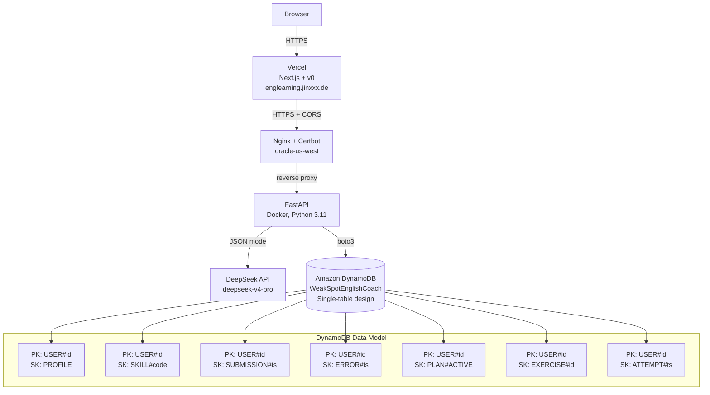

# Devpost Submission — H0 Hackathon

## Quick Info

- **Project**: WeakSpot English Coach
- **Tagline**: Instead of asking what you want to practice, it discovers what you need to practice.
- **Track**: Monetizable B2C App (Education) / Open Innovation
- **AWS Database**: Amazon DynamoDB (single-table design)
- **Vercel URL**: https://englearning.jinxxx.de
- **Vercel Team ID**: [LOOK UP in Vercel Dashboard → Team Settings]

---

## Text Description (for Devpost)

### What it does

WeakSpot English Coach is an adaptive AI-powered English learning app. The learner simply writes English — a paragraph, a chat message, anything — and the system analyzes it against an 11-category error taxonomy (verb tense, articles, prepositions, word choice, register, sentence variety, etc.). It returns a detailed diagnostic report with CEFR level estimation, structured errors with micro-lessons, and then **writes everything into DynamoDB** to build an evolving, persistent "weakness profile."

From that profile, WeakSpot generates a personalized 7-day learning plan targeting the learner's weakest skills, creates targeted practice exercises, grades answers, and continuously updates skill mastery scores. **Every interaction tightens the model** — the database IS the learner's long-term memory, which is what makes the system genuinely adaptive.

### The problem it solves

Most AI English tutors are stateless. Every session starts from zero. The learner has to know what to ask. WeakSpot is different — it doesn't ask what you want to practice, it **discovers** what you need to practice by analyzing your actual English output and tracking your weaknesses over time.

### Why DynamoDB (and how we use it)

We chose DynamoDB because it's a perfect fit for the learner-profile data model:

- **Single-table design** (`WeakSpotEnglishCoach`) — one table holds profiles, skill states, submissions, errors, plans, exercises, attempts, notes, chat messages, and dedup markers. The partition key is `USER#{userId}` and the sort key encodes entity type + timestamp, so all of a learner's data lives in one contiguous partition.
- **Serverless & pay-per-request** — perfect for a B2C education app where traffic patterns follow daily learning sessions. No cold starts, no idle costs, no connection pooling.
- **Atomic skill mastery updates** — when a learner submits practice, the skill mastery delta is computed and written in the same request flow. The 11-category taxonomy is tracked per-user-per-skill with exact error/correct counts.
- **De-duplication via hash markers** — identical text re-submissions are detected via `SUBHASH#` records and don't re-penalize skill scores, keeping the weakness model clean.
- **Manual delete with skill rollback** — deleting a submission reverses its error count impact on affected skills, maintaining data integrity.

### Tech stack

- **Frontend**: Next.js 16 (App Router) + TypeScript + Tailwind CSS + shadcn/ui, generated with **Vercel v0**
- **Frontend deploy**: **Vercel** (HTTPS, global CDN)
- **Backend**: **FastAPI** (Python 3.11), Docker on Linux (ARM64), Nginx + Certbot
- **AI**: **DeepSeek-V4-Pro** (primary) + DeepSeek-V4-Flash (fast tasks) — OpenAI-compatible JSON mode with Pydantic validation
- **Database**: **Amazon DynamoDB** — single-table design, boto3
- **Auth**: GitHub OAuth + Google OAuth with session cookies
- **Voice**: OpenAI Realtime API with backend sideband monitoring

### What's unique

1. **Database-driven personalization** — the learner profile IS in DynamoDB, not in a stateless LLM prompt. Skills, errors, and mastery evolve across every session.
2. **11-category structured error taxonomy** — not just "this sounds wrong" but specific, actionable diagnostics (verb tense, article, preposition, word choice, repetition, clarity, register, sentence variety, transition, Chinese-English transfer, completeness).
3. **Closed-loop adaptive learning** — diagnose → profile → plan → practice → grade → update → repeat. Every step writes to and reads from DynamoDB.
4. **Monetizable B2C architecture** — usage-based DynamoDB costs scale with user activity, per-user rate limiting is server-enforced by identity role (guest/user/member/owner), and the whole stack is pay-as-you-go with no fixed infrastructure spend.

### How to try it

1. Visit https://englearning.jinxxx.de
2. The home page shows a sample English paragraph — click "Analyze My English"
3. See the diagnostic report with CEFR level, errors, and micro-lessons
4. Go to Dashboard to see your weakness radar
5. Go to Plan to generate a personalized 7-day plan
6. Go to Practice to do a targeted exercise
7. Check History to see all past submissions

---

## Architecture Diagram (Mermaid — for Devpost)

## Mermaid diagram code (paste into Devpost)

Copy the code block above into Devpost's description field (Devpost supports Mermaid via their markdown renderer, or you can screenshot the diagram).

---

## Demo Video Script (< 3 minutes)

### Structure (total: ~2:45)

**0:00-0:20 — Intro & Problem**
- "Most AI English tutors are stateless. Every session starts from zero. You have to know what to ask."
- "WeakSpot is different — it discovers what YOU need to practice."

**0:20-1:00 — Diagnose Demo**
- Show the home page at https://englearning.jinxxx.de
- Click "Analyze My English" on the sample paragraph
- Walk through the diagnostic report: CEFR badge, score ring, error cards with micro-lessons
- "Each error is tagged with a category from our 11-category taxonomy"

**1:00-1:30 — Dashboard (the DynamoDB proof)**
- Navigate to /dashboard
- Show the weakness radar chart — "This data comes from DynamoDB. Every diagnosis updates your skill mastery."
- Show the "weakest skills" list — "The system knows exactly what you need to work on."

**1:30-1:55 — Plan & Practice**
- Go to /plan, show the 7-day personalized plan
- "This plan is generated FROM your DynamoDB weakness profile — weakest skills first."
- Go to /practice, show a generated exercise, submit an answer, show grading

**1:55-2:25 — DynamoDB Deep Dive**
- Switch to AWS Console screenshot
- Show the `WeakSpotEnglishCoach` table
- "Single-table design: USER#{id} partition key, sort keys encode entity types — PROFILE, SKILL#, SUBMISSION#, ERROR#, PLAN#ACTIVE..."
- "All of one learner's data lives in one contiguous partition. Serverless, pay-per-request, zero cold starts."

**2:25-2:45 — Closing**
- Show the adaptive loop diagram
- "Diagnose → profile → plan → practice → grade → update. Every interaction tightens the model."
- "WeakSpot English Coach — built with Vercel v0, FastAPI, and Amazon DynamoDB."
- "#H0Hackathon"
